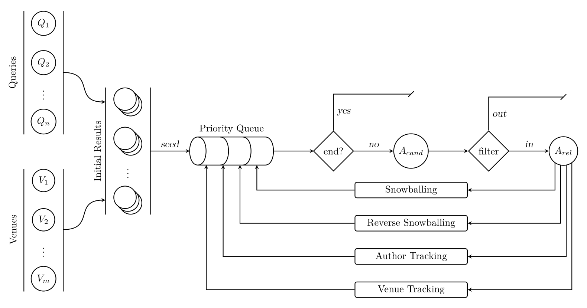

# Tooling for Literature Reviews

**Tags:** tooling, automation, search, late binding

## Introduction

Article databases (like those at [ACM](https://dl.acm.org), [IEEE](https://ieeexplore.ieee.org/Xplore/home.jsp), [Elsevier](https://journalfinder.elsevier.com) and [Scopus](https://www.scopus.com)) provides us with simple means for searching. This, however, is not particularly conductive to tasks such as literature reviews. For instance, no metric for scoring is provided and there is no export functionality. Furthermore, the scoring function is unknown instead of user specifiable.

Recently, though, [ACM has gone open access](https://authors.acm.org/open-access). This should enable up to construct literature review tooling that is orders of magnitude more convenient to work with.

## Problem

How can we produce tooling that exposes a better interface to people who are doing literature reviews?

In particular:
- How can articles behind a paywall be scanned?
- How should an index for this be structured?
- To which degree can a scoring function be user-defined?
- What should the workflow look like?
- How can a web interface support this workflow?

## Approach

Potential avenues of exploration:
- On-demand client (who needs login) pull of articles to a shared pool.

## Related Work

From [Report Writing and Friends](https://github.com/aslakjohansen/report-writing):

