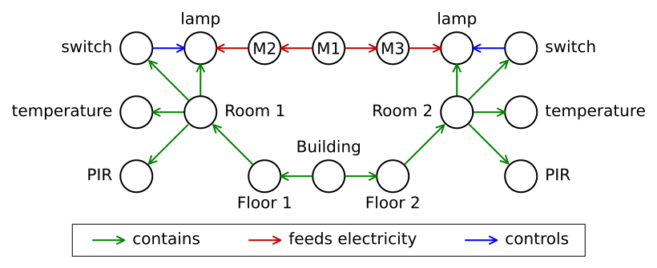

# Privacy Analyzer

**Tags:** graph processing, privacy, data transformation, data representation, component analysis, accuracy analysis

## Introduction

An information model might contain the following information:

Here, the spatial relationships are described using green edges, the electrical distribution tree using red edges (connecting a single main meter and two submeters with equipment) and the control signals from switch to lamp using blue edges. Switches, temperature sensors and PIR sensors each produce a stream of timeseries data.

The data from the PIR sensors come with clear privacy implications. However, using various techniques we can -- at some accuracy -- transform one set of modalities on a context (e.g., a room) to another modality describing that context. For instance, by comparing the temperature changes of a room with the outdoor temperature changes we could retroactively -- at some probability -- determine when that room was occupied. That information is the same as what we get from a PIR sensor, meaning that room temperature data is associated with privacy implications.

A transformation is -- at its essence -- a piece of logic that takes *n* streams of data (representing certain modalities in certain contexts, with certain restrictions on the contexts) and produces at least one stream of data (again, epresenting certain modalities in certain contexts, with certain restrictions on the contexts).

Before some set of modalities are released for a given context, one should consider how a suite of transformations can be applied to gain modalities that are not directly released. It may be that once a new modality in introduced through application of a transformation another transformation becomes applicable, and one that is applies another becomes applicable, and so on. While repeated transformations can generate signals for a wide range of modalities the accuracies of many of these will suffer.

Some implication comes from operations of contexts. For instance, if meter M3 measures zero, and meter M1 observes a change, one can conclude that that change must have come from the switch controlling the lamp attached to meter M2. That means that there is someone in Room 1, and that has privacy implications.

The example above can be modeled using Brick (see related work). Brick is only applicable to the domain of operational buildings. Brick, however, is based on RDF, and RDF has wider applicability.

## Problem

Make a tool that can analyze an information model describing a dataset in order to determine the privacy implications of publishing that dataset.

**Stretch goal:** Allow for interactive manipulation of the subset of modalities to release in order to answer questions like:
1. What would happen to the privacy implications if I don't release modality 1?
2. How does the transformation graph that leads to modality 2 look?
3. If I want to lower the accuracy of the best transformation to modality 3 which modalities do I need to exclude (or reduce accuracies of) from the publication?

## Approach

1. Implement a naive implementation (e.g., own implementation of graph algorithms over in-process object-oriented data structure).
2. Document lessons learned.
3. Litterature review rooted in lessons learned.
4. Determine metrics for evaluation.
5. Iterate:
    1. Use intuition/measurements to find area to target for improvement.
    2. Improve according to intuition/reasoning.
    3. Evaluate against previous iteration.
    4. Document observations

Part of the iteration process is to determine the best data model. Options include:
- In-process data structure.
- Graph database.
- RDF-based triple store.

## Related Work

- [Tool-chain for supporting privacy risk assessments](https://www.youtube.com/watch?v=A81B53vrtT0&list=PL6jLuiS6wP5aVoY5x1D23c9gMXzrtfO_e&index=4)
- [SymPy](https://www.sympy.org)
- [Brick](https://brickschema.org)
- [Gremlin](https://en.wikipedia.org/wiki/Gremlin_(query_language))

